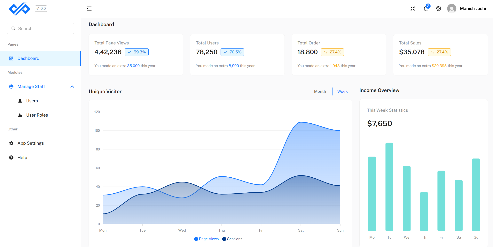

Perfect — thanks for the context!

Here’s a clean and professional version of your README message tailored specifically for **Thapathali Campus CMS**, developed by the **EMIS Unit**. This emphasizes its purpose, real-world use, and contributors.

---

[](#license)

# 🏫 Thapathali Campus CMS

This repository contains the **official Content Management System (CMS)** for **Thapathali Campus**, developed and maintained by the **EMIS Unit**.
It is a fully functional, production-ready system designed to manage institutional data, departments, announcements, users, and more.

Built using modern frontend technologies, this system ensures smooth performance, scalability, and a rich user experience for both staff and admins.

<br/>

<div align="center">
  
</div>

<br/>

# 🤝 Contributing to the Project

> **"A good pull request reflects a good contributor!"**

We follow standard contribution workflows. To maintain code quality and consistency, please read and follow our [contribution guidelines](https://github.com/ManishJoc14/tcioe-cms/blob/main/CONTRIBUTING.md).
PRs that don’t follow the structure or appear spammy may be declined or flagged.

---

## ⚙️ Getting Started Locally

1. **Clone the repository**

   ```bash
   git clone https://github.com/ManishJoc14/tcioe-cms
   ```

2. **Install dependencies**

   ```bash
   yarn
   ```

3. **Run the development server**

   ```bash
   yarn start
   ```

---

## ✨ Features

* 🧱 Custom-built UI using Material UI v5
* ⚛️ Developed using React 19 and the modern Hooks API
* 🔁 Global state via Context API + Redux Toolkit
* 📡 Efficient data fetching with SWR
* 🚦 Route handling via React Router v7
* ⚡ Fast development with Vite
* 🎨 CSS-in-JS with Emotion
* 📅 Integrated charts, calendars, tables, and more
* 💾 Persistent state using Redux Persist
* 📚 Robust form validation using `react-hook-form` and `zod`

---

## 🛠 Tech Stack

| Category         | Stack                                     |
| ---------------- | ----------------------------------------- |
| **Framework**    | React 19, Vite                            |
| **UI**           | Material UI (v5), Ant Design Icons        |
| **Routing**      | React Router v7                           |
| **State**        | Context API, Redux Toolkit, Redux Persist |
| **Forms**        | React Hook Form, Zod                      |
| **Charts**       | ApexCharts                                |
| **PDF/Excel**    | jsPDF, jsPDF AutoTable, SheetJS (xlsx)    |
| **Tables**       | MUI X Data Grid                           |
| **Utilities**    | RTK, Day.js, Lodash, File Saver           |
| **Styling**      | Emotion, Fontsource                       |
| **Code Quality** | Prettier, Husky, Lint-Staged              |

---

## 📌 Contribution Guidelines

Please check the [CONTRIBUTING.md](/CONTRIBUTING.md) file for detailed steps before contributing.

---

## 📜 License

This project is protected under a [Private License](./LICENSE).
Ensure you understand the license terms before using or modifying the source.

---

## 🌟 Support the Project

If you find this project helpful or use it internally, **consider dropping a star ⭐** on the repository.
Big thanks to everyone from the **Thapathali Campus EMIS Unit** and contributors who are building and improving this system.

---
